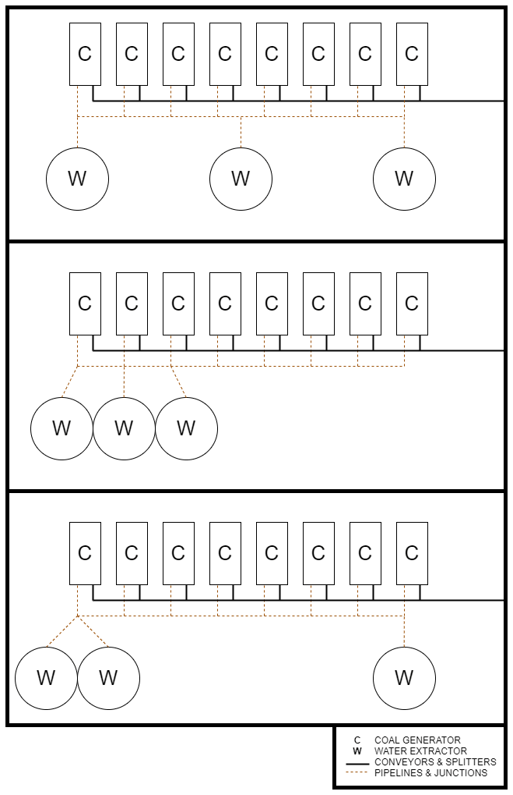

## Water
At 100% clock speed, one Coal Generator consumes 45 m3 Water/min, no matter what fuel is used.
## Ratio's
Number of Coal Generators required (100%):  
`Coal generator = Coal mining rate / 15`

Number of Water Extractors required:  
`Water extractor = Coal generator / 2.6666`

Spread out the water supply across multiple Mk.1 pipelines as following:  
`Mk.1 Pipelines required = Coal generator / 6.6666`

Some commonly used ratios are:  
# Coal Generator Setup and Efficiency Chart

| Miner Mk. | Purity  | Coal/min | Water Extractors (@ 100%) | Water Extractors (@ 75%) | Water (m³/min) | No. of Coal Generators | Gross Power |
|---|---|---|---|---|---|---|---|
| Mk.1 | Impure | 30 | 0.75 | 1 | 90 | 2 | 150 MW |
| | Normal | 60 | 1.5 | 2 | 180 | 4 | 300 MW |
| | Pure | 120 | 3 | 4 | 360 | 8 | 600 MW |
| Mk.2 | Impure | 60 | 1.5 | 2 | 180 | 4 | 300 MW |
| | Normal | 120 | 3 | 4 | 360 | 8 | 600 MW |
| | Pure | 240 | 6 | 8 | 720 | 16 | 1200 MW |
| Mk.3 | Impure | 120 | 3 | 4 | 360 | 8 | 600 MW |
| | Normal | 240 | 6 | 8 | 720 | 16 | 1200 MW |
| | Pure | 480 | 12 | 16 | 1440 | 32 | 2400 MW |

# Valid Starter Layouts
{ width="1000" loading=lazy align=right }

[Source](https://satisfactory.fandom.com/wiki/Coal_Generator#100%_Miner)