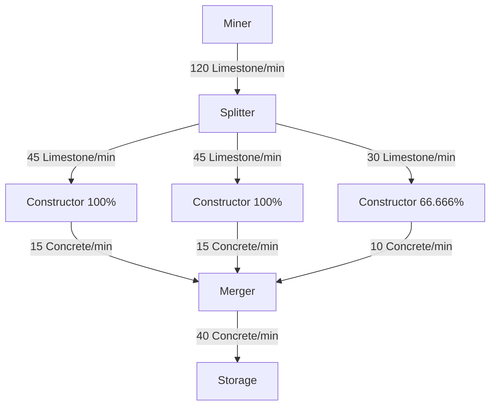
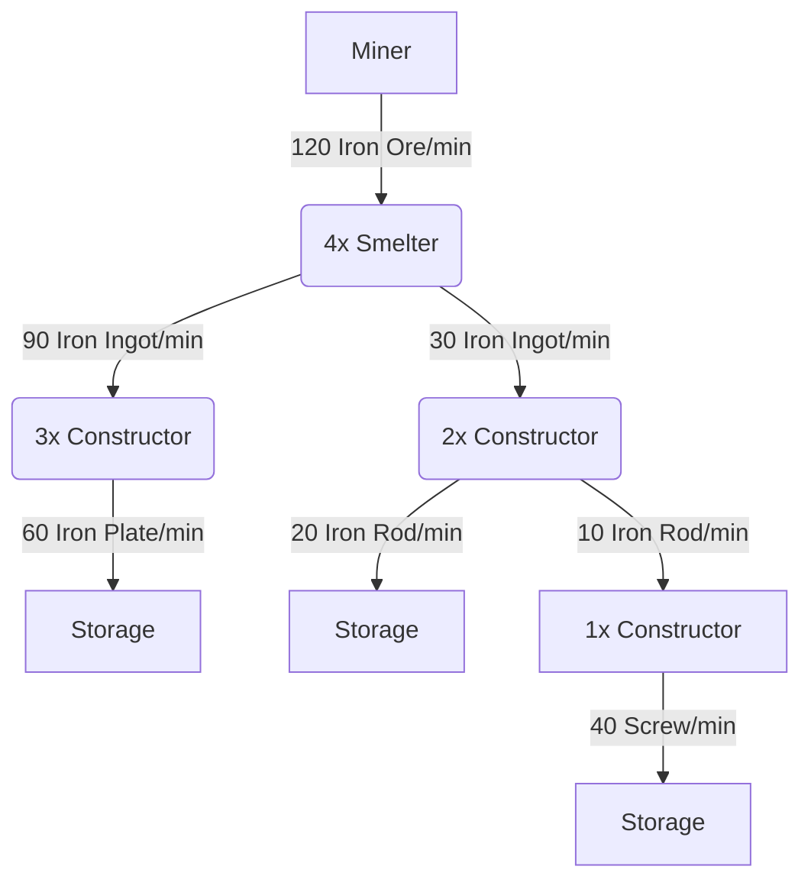
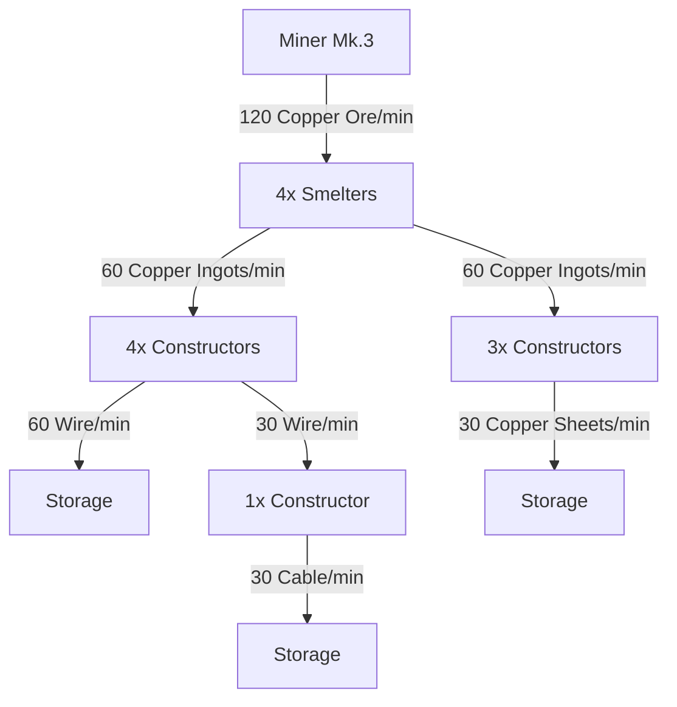
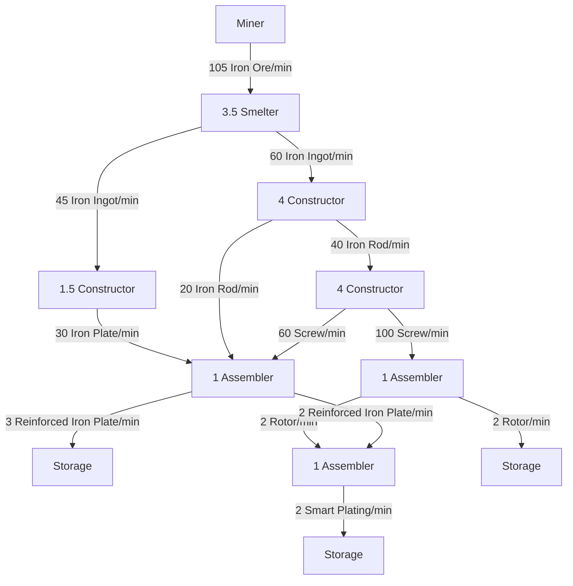
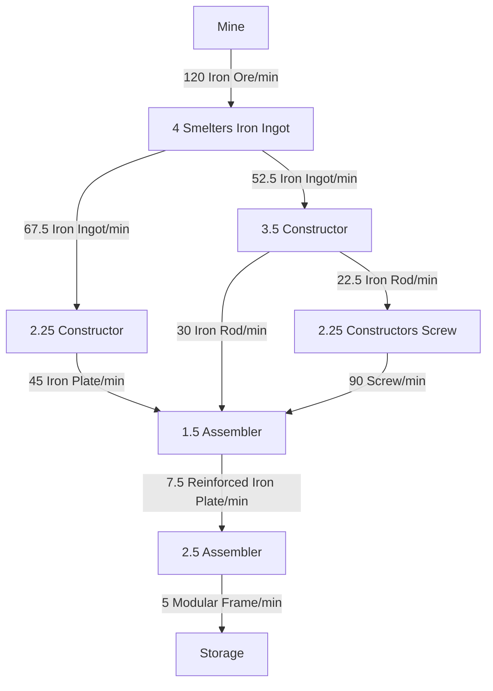

# Starter Layouts
## Concrete Starter
120 Limestone in  
45 Concrete out

## Iron Starter
120 Iron Ore in  
60 Iron Plate, 20 Iron Rod, 40 Screw out

## Copper Starter
120 Copper Ore in  
60 Wire, 30 Cable, 30 Copper Sheet out

## Advanced Iron
Requires underclocking but Will get the job done early game  
105 Iron Ore in  
3 Reinforced Iron Plate, 2 Rotor, 2 Smart Plating out

## Modular Frame
120 Iron Ore in  
5 Modular Frame/min out
