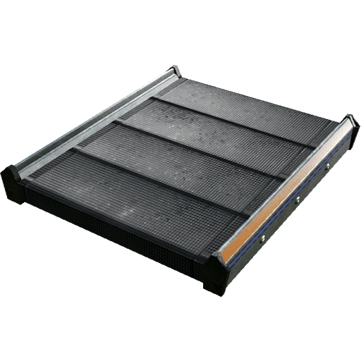
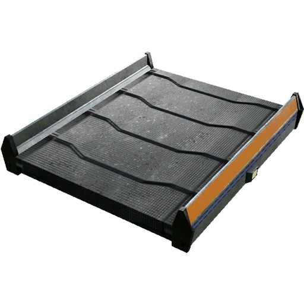
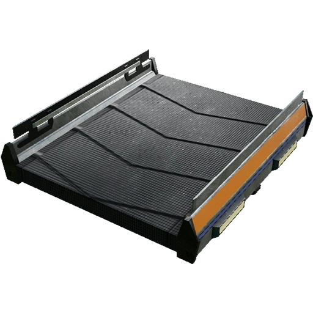
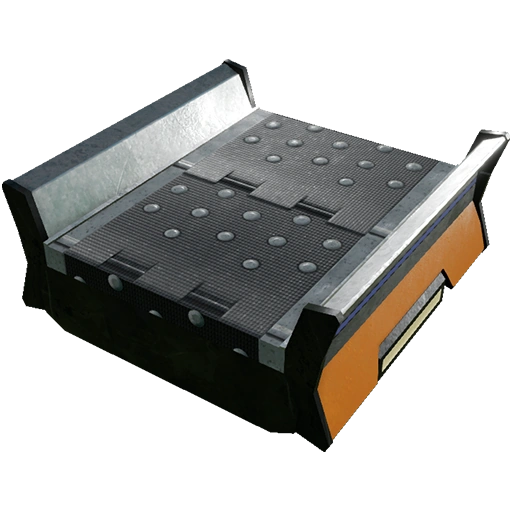
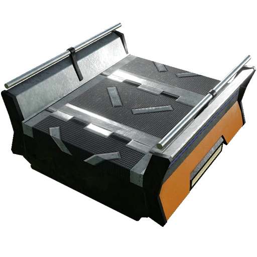
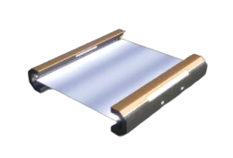

# Conveyor Belt

## Lenght
The maximum length of a conveyor belt is 56 meters

## Conveyor Belt Comparison

| Belt Type | Throughput | Speed Difference | Image |
|---|---|---|---|
| Mk.1 |60 i/m| N/A | { width="100" loading=lazy align=right } |
| Mk.2 |120 i/m | 2x | { width="100" loading=lazy align=right } |
| Mk.3 |270 i/m| 2.25x | { width="100" loading=lazy align=right } |
| Mk.4 |480 i/m| 1.77778× | { width="100" loading=lazy align=right } |
| Mk.5 |780 i/m| 1.625× | { width="100" loading=lazy align=right } |
| Mk.6 |1200 i/m| 1.538× | { width="100" loading=lazy align=right } |

## Pioneer transportation

| Belt Type | Speed (standing) | Speed (Running with Blade Runners)
|---|---|---|
| Mk.1 | 4.32 km/h | 52.92 km/h |
| Mk.2 | 8.64 km/h | 57.24 km/h  |
| Mk.3 | 19.44 km/h | 68.04 km/h |
| Mk.4 | 34.56 km/h | 83.16 km/h |
| Mk.5 | 56.16 km/h | 104.76 km/h |
| Mk.6 | 86.4 km/h | 135 km/h |